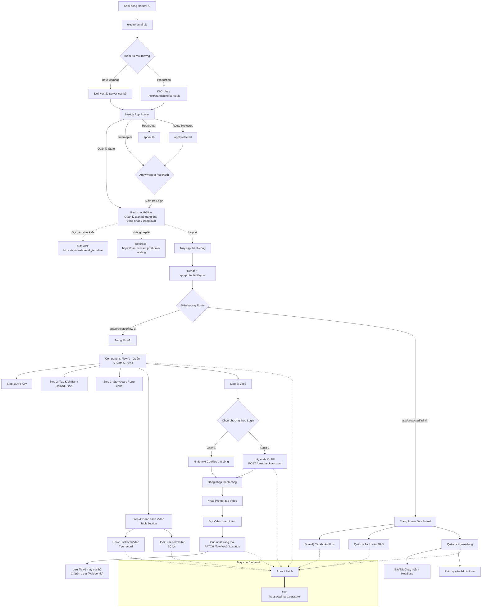
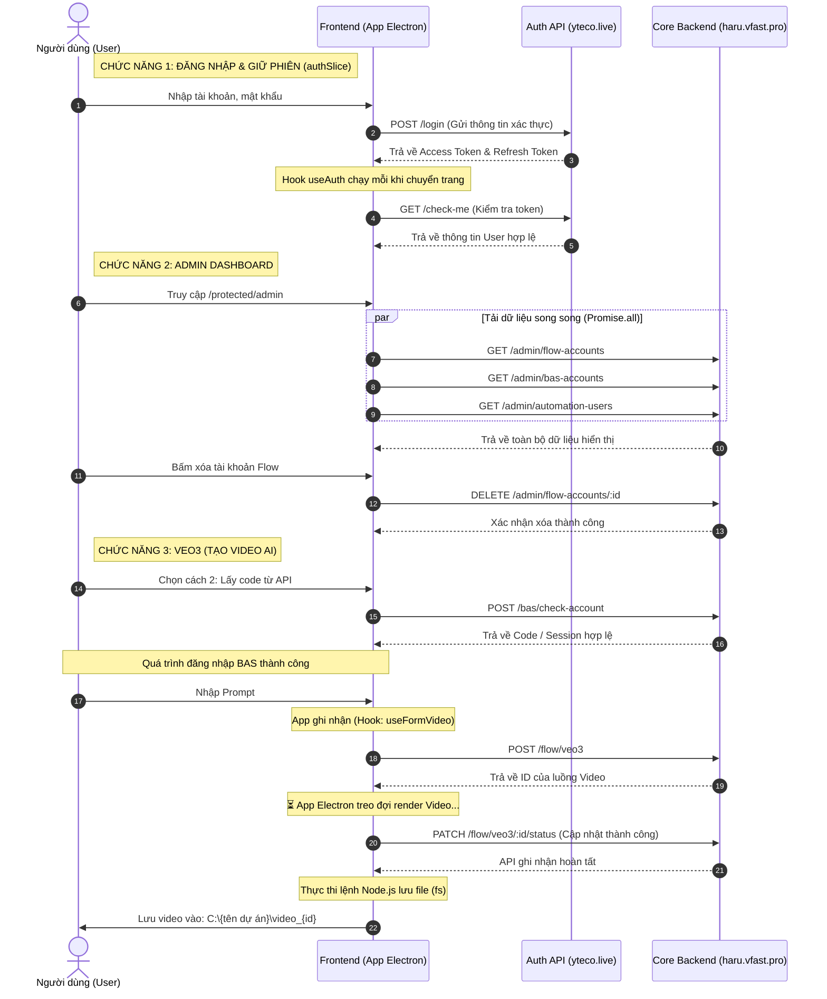
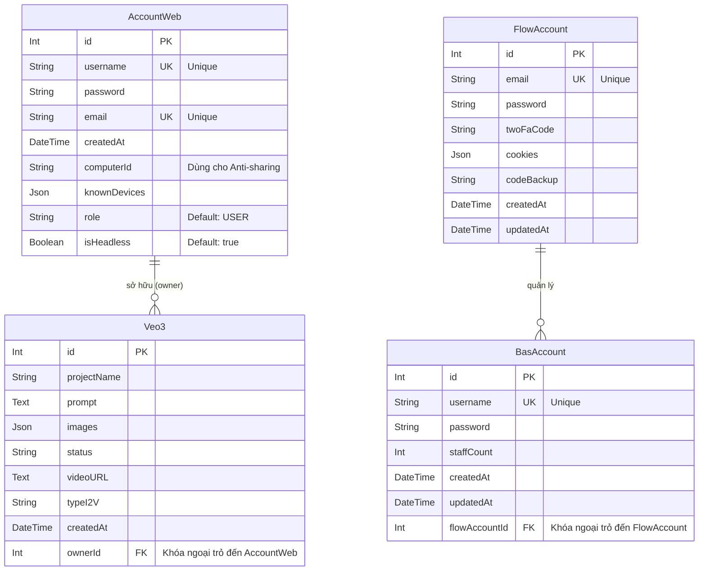
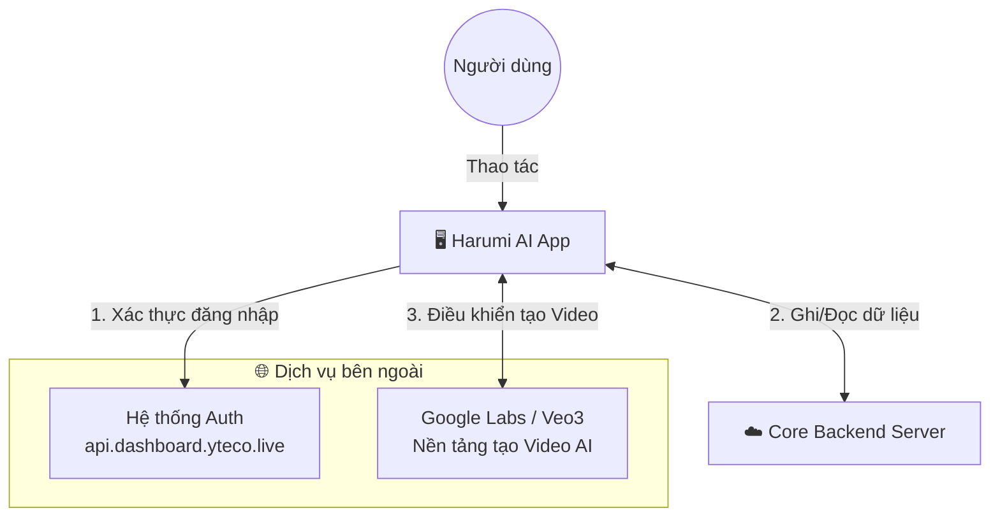

# Kiến trúc Ứng dụng Harumi AI

**Harumi AI** là một hệ thống phần mềm Desktop (được xây dựng trên nền tảng Electron và Next.js) kết hợp với Backend Core mạnh mẽ (NestJS). Hệ thống được thiết kế chuyên biệt để tự động hóa quy trình sáng tạo nội dung, đặc biệt là việc tự động hóa quá trình tạo Video AI (Veo3) thông qua nền tảng Google Labs.

**Các chức năng cốt lõi của hệ thống bao gồm:**
1. **Bảo mật & Định danh:** Quản lý đăng nhập, giữ phiên (session) an toàn qua hệ thống Auth độc lập.
2. **Quản trị Tài nguyên (Admin Dashboard):** Quản lý tập trung các tài khoản Flow (Google Labs), tài khoản phần mềm Automation (BAS) và phân quyền/theo dõi người dùng (Automation Users).
3. **Quy trình Tự động hóa AI (FlowAI 5 Bước):** 
   - Quản lý luồng công việc từ lúc tạo kịch bản (Upload Excel), dựng storyboard cho đến khi xuất danh sách Video.
   - Tích hợp công cụ Browser Automation (Puppeteer/Playwright) chạy ngầm ngay bên trong Desktop App. Công cụ này sẽ tự động đăng nhập (qua Cookies hoặc Code lấy từ API), nhập Prompt và tương tác trực tiếp với Google Labs để sinh ra Video AI.
4. **Đồng bộ & Lưu trữ:** Theo dõi trạng thái tiến trình Video từ xa và tự động tải Video hoàn chỉnh về lưu trữ tại ổ cứng cục bộ (Local File System) của người dùng.

Tài liệu dưới đây cung cấp cái nhìn chi tiết về sơ đồ luồng (Flowchart), trình tự gọi API (Sequence Diagram), sơ đồ cơ sở dữ liệu (ERD) và kiến trúc tổng thể của hệ thống.
## 1. Sơ đồ Luồng (Flowchart)

## 2. Sơ đồ Tuần tự (Sequence Diagram)

Mô tả chi tiết quá trình gọi API giữa Frontend và Backend.

## 3. Sơ đồ Cơ sở dữ liệu (ER Diagram)

Sơ đồ quan hệ thực thể (ERD) được trích xuất trực tiếp từ cấu trúc `schema.prisma` ở Backend (NestJS).

## 4. Sơ đồ Kiến trúc Hệ thống (System Architecture)

Sơ đồ tổng quan cấp cao mô tả các thành phần cấu tạo nên hệ thống và cách chúng tương tác với các tác nhân (Actors) và Dịch vụ bên ngoài (External Services). Hệ thống sử dụng **Trình duyệt tự động (Puppeteer/Playwright)** tích hợp ngay bên trong Desktop App để xử lý AI.

